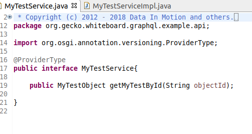
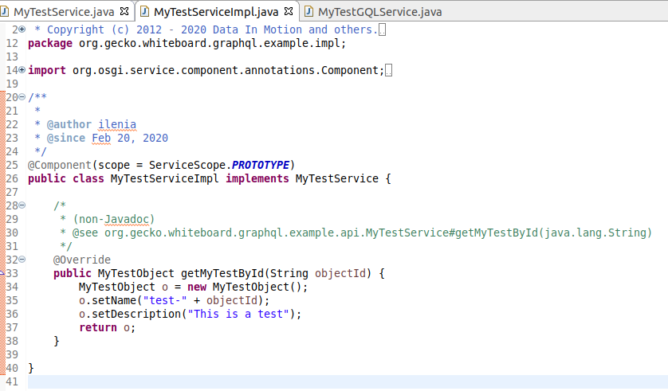
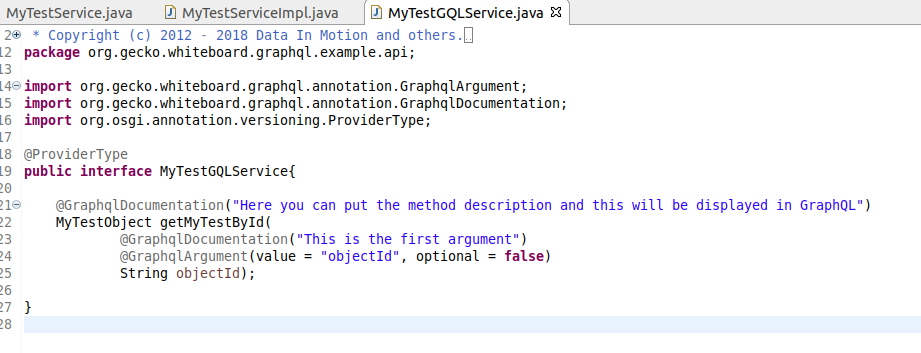
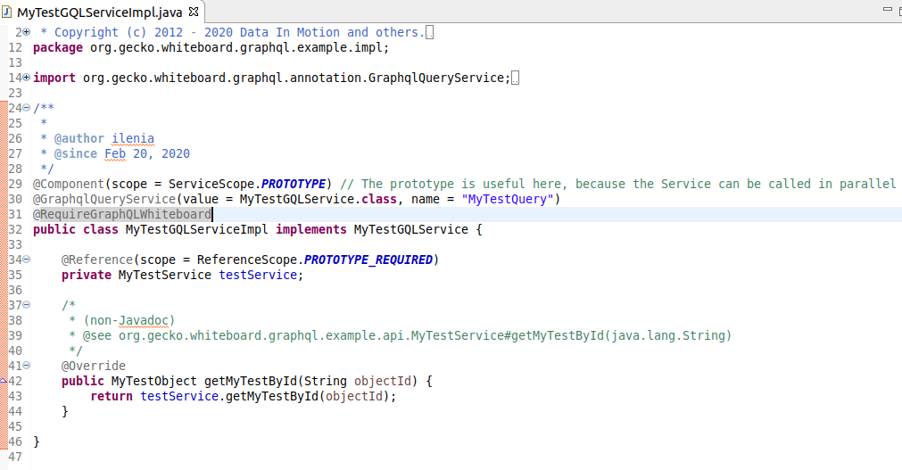
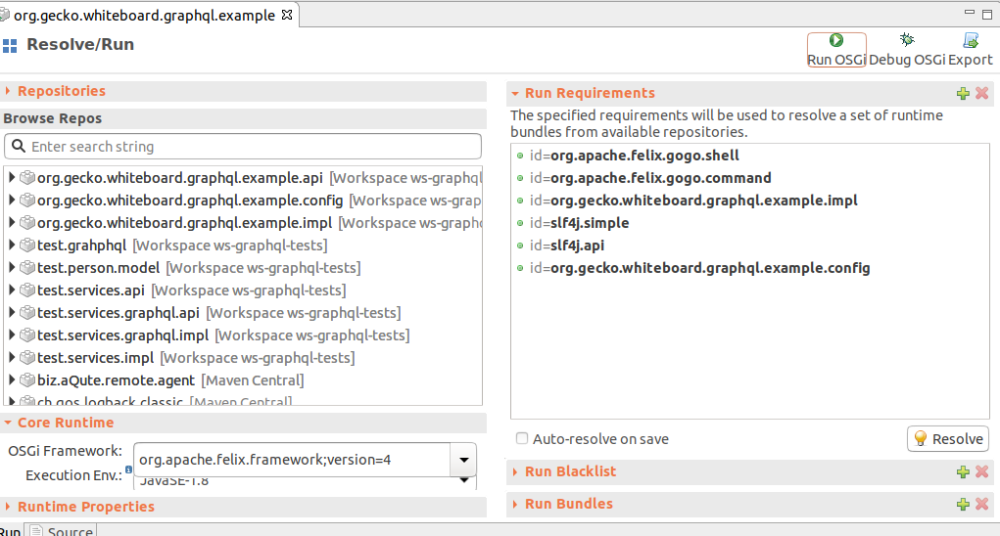
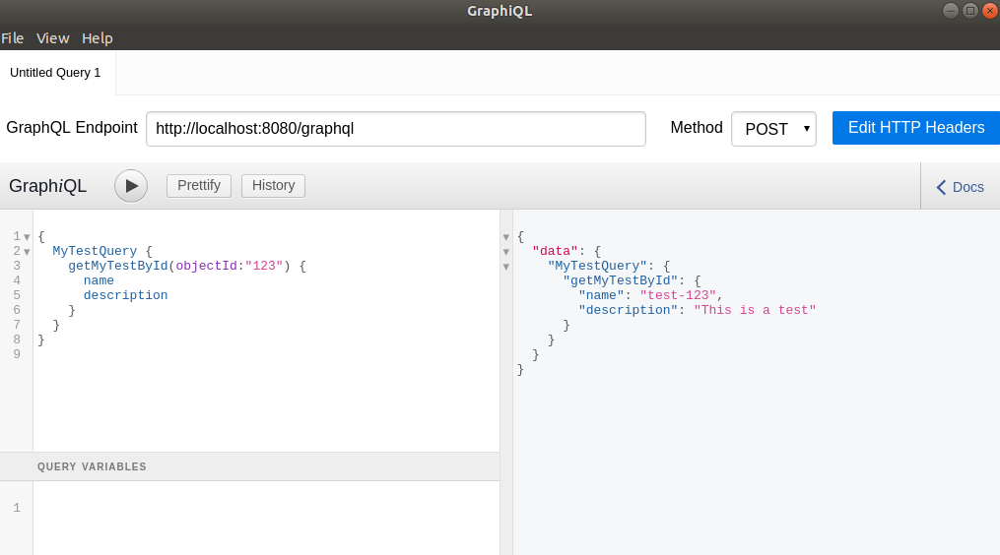
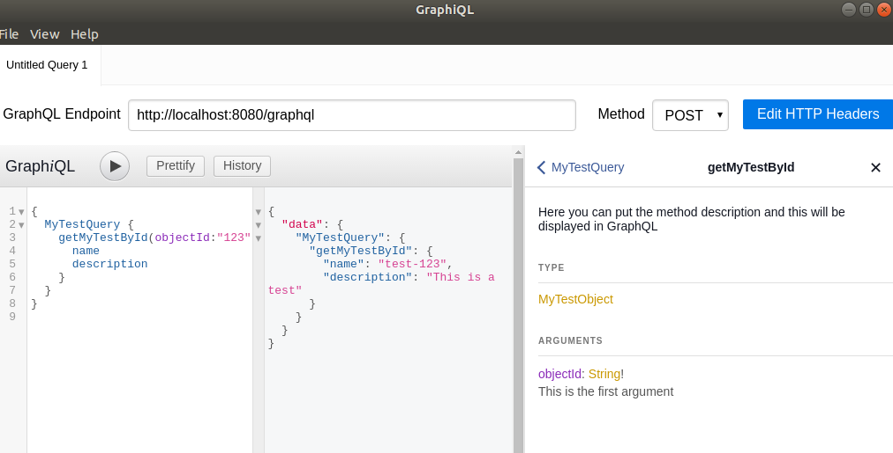

# Expose OSGi Services via GraphQL 

**Please note**: example contained in this bundle is incomplete and is now deprecated. Please use automated test contained in `org.gecko.whiteboard.graphql.emf.example.test` bundle, which covers all methods from implementation contained in `org.gecko.whiteboard.graphql.emf.example.service` bundle.

---

In this tutorial we provide some guidelines in order to be able to expose your OSGi services,  which return simple Pojos, via GraphQL. If instead you are using EMF, the only thing that changes is an annotation and a few dependencies, as we mention at the end of the tutorial, but you can read the tutorial as well, since the basic steps are the same. Let`s start!

1. Create your Pojos (or your Ecore model, if you are using EMF). We created a simple Pojo called *MyTestObject*

   

2. Create your services, as you are used to with OSGi

   

​	Note that we have put as service scope **PROTOTYPE**.

3. Then we need to build the GraphQL facade for our service. 

   

   We define an interface with our methods, as we have done for the previous service. In addition, each argument of the method has the annotation `org.gecko.whiteboard.graphql.annotation.GraphqlArgument`. You can also add some useful documentation through the other annotation `org.gecko.whiteboard.graphql.annotation.GraphqlDocumentation`, which will be then displayed in GraphQL. 

   The service implementation will look as

   

   In addition to the usual `@Component` annotation you just need to add the `org.gecko.whiteboard.graphql.annotation.GraphqlQueryService`, specifying which interface you are implementing and a name for your service, which will be the one you could then use in GraphQL to call it. In this case we just used the `GraphqlQueryService` annotation, because our service is just performing a query operation. If you also want to implement some mutation operations within your service you could let your service implement an additional interface with the mutation methods and then, in the implementation, you would need to add an an additional notation (`org.gecko.whiteboard.graphql.annotation.GraphqlMutationService`). The third annotation of the example is the `org.gecko.whiteboard.graphql.annotation.RequireGraphQLWhiteboard`, which will be used to load the required dependencies at runtime.

   Then you can simply reference your internal service and delegate the actual functionality to it.

4. Next step is to set up the runtime. Create a `.bndrun` file, and put the dependencies to your service implementation and to the configurator and that`s it. All the other dependencies are resolved through the annotations. 

   

5. The Result will be a GraphQL API running under http://:8082/graphql in which you can do something like

   

   where we used the [graphiql-app](https://github.com/skevy/graphiql-app). By clicking on the *Docs* tab you can access the documentation you add through the `org.gecko.whiteboard.graphql.annotation.GraphqlDocumentation` annotation.

## What changes if you are using EMF?

In case you are using EMF and not simple Java Pojos, you can basically follow all the previously described steps. You just need to substitute the annotation `org.gecko.whiteboard.graphql.annotation.RequireGraphQLWhiteboard` in your GraphQL facade service with `@RequireEMFGraphQLWhiteboard`. This should take care of adding to your runtime the required EMF dependencies. 

